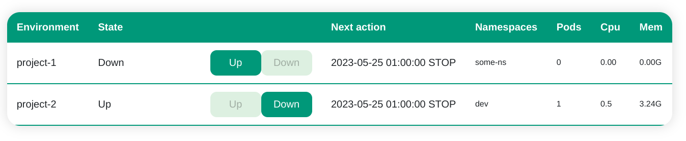

# ns-scheduler

ns-scheduler is a tool to schedule the work time of applications deployed to the kubernetes cluster 
for development/testing purposes to not waste resources during nights, weekends, and holidays
when no one is using them.



The scheduler works by scaling all Deployments and StatefulSets in groups of namespaces named "environments"
to 0 replicas and then back to the initial replica count by defined schedules. 

It also provides a simple web dashboard to show the current state and allow manual control. It can be used even 
without any schedules defined to enable easy apps mass startups and shutdowns on demand.

It also exposes a REST API to allow integration with other tools like CI/CD pipelines. 

## Known limitations:
(subject to change in future updates)

- no authentication. Both the scheduler and the dashboard are meant to be run within a restricted environment, to which only trusted users have access
- is incompatible with deployments that use HPA (Horizontal Pod Autoscaler) - the scheduler will scale the deployment to 0 replicas, but HPA will scale it back to the initial replica count
- is incompatible with deployments/statefulsets controlled by operators (like postgres-operator, kafka-operator, etc.) - the scheduler will scale the deployment to 0 replicas, but the operator will scale it back to the initial replica count

## Installation

### Via Helm charts

1) Clone the repository
2) run ```helm install -n <namespace> <release-name> helm/chart -f values.yaml```
3) Add ingress to the dashboard service with the ingress type you prefer. At the moment the chart provides support for Istio ingress gateways only

## Configuration

When installing the `ns-scheduler` you have to provide configuration to define named environments and its schedules.
For example:

```yaml
scheduler:
  config:
    schedules:
    
      # this is an empty schedule defining no start or stop actions to use with environments you want to controll manually
      empty:
        timezone: UTC
        weekdays: []
        holidays: []
    
      # this a schedule describing a typical work week with a long weekend
      standard-week:
        # Timezone used for time specs in the schedule
        timezone: UTC
        # Moments for starting and stopping environments could be described with "weekdays" - a weekly schedule
        # and "holidays" - full datetime pairs for starts and stops. "Weekdays" schedules do not apply inside time
        # intervals described by "holidays"
        weekdays:
          # Monday = 1, Sunday = 7
          - days: [ 1,2,3,4,5 ]
            start: 09:00
            stop: 20:00
        holidays:
          # Make sure to use "YYYY-mm-dd HH:MM" or "YYYY-mm-dd HH:MM:SS" formats for start and stop times
          # The stop times must precede the start times
          # If weekday and holiday moments have the same timestamp - holiday action will be performed
          # (and weekday action will be ignored)
        
          # Christmas 2022
          - stop: 2022-12-23 22:00
            start: 2023-01-03 09:00
          # May day 2023
          - stop: 2023-04-30 22:00
            start: 2023-05-03 09:00
      
      two-shifts-week:
        timezone: UTC
        weekdays:  
          - days: [ 1,2,3,4,5,6,7 ]
            # Both start and stop fields can be either times or lists of times
            start:
              - 03:00
              - 16:00
            stop:
              - 10:00
              - 20:00
  
      # Environment is a named collection of namespaces to be manipulated as a whole
      envs:
        project-1:
          namespaces:
            - project-1
          schedule: empty
        project-2:
          namespaces:
            - project-2-data
            - project-2-services
          schedule: standard-week
        project-3:
          namespaces:
            - project-3
          schedule: standard-week
        project-4:
          namespaces:
            - project-4
          schedule: two-shifts-week

```

Please refer to the chart's values.yaml for other configuration options
